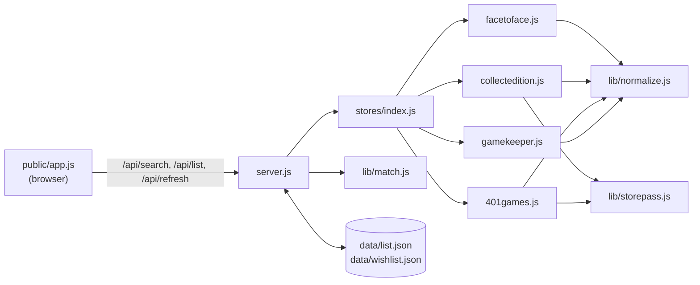

# Architecture

A small local web app with no build step: an Express 5 server, one adapter per store, and a vanilla JS page.
The server fetches each store's public search data on demand, normalizes it, and merges it into one row per
card printing.



## Two modes

Every layer takes a `mode`:

| | `sell` (Selling) | `buy` (Buying) |
|---|---|---|
| Store call | `adapter.search(name)` | `adapter.searchRetail(name)` |
| Price shape | `{ cash, credit, retail }` | `{ price, stock }` |
| Best store | highest credit (or cash, per the UI toggle) | cheapest with `stock > 0` |
| Saved list | `data/list.json` | `data/wishlist.json` |

## Components

### `server.js`
- Serves `public/` and the JSON API (see [README](../README.md#api)).
- `searchAll(query, { mode, force })`:
  - Reduces the query to its front name (`frontName`).
  - Calls every adapter in parallel. A failing store is recorded in `errors` and contributes no offers; it never fails the whole search.
  - Merges the offers with `mergeOffers`.
- **Cache**: in memory, 10 minutes, keyed by `mode|query`. Results with any store error are **not** cached, so the next search retries that store.
- `POST /api/refresh` re-searches each distinct front name in the list (sequentially, `force: true`) and finds each item's row by `item.key ∈ row.keys`. Stores that failed keep their **last known prices** instead of being wiped.
- Lists are written atomically (write `*.tmp`, then rename).
- The lists live in `data/` unless `DATA_DIR` points elsewhere. `npm run start:test` copies both lists into `data-test/` and serves them on port 3999, so testing never touches the real files.
- Errors are returned as JSON (`{ error }`), because the page always parses JSON.

### `stores/*.js` — adapters
One file per store, registered in `stores/index.js`. The UI builds its columns from this registry.

```js
module.exports = {
  id: 'f2f',                // key in row.prices
  label: 'Face to Face',    // column header
  creditNote: 'cash + 30%', // header tooltip in Selling
  search(name),             // -> Offer[] with { cash, credit, retail }
  searchRetail(name),       // -> Offer[] with { price, stock }
};
```

Each adapter maps its store's data onto a shared **printing identity** and then adds the mode's prices.
Per-store sources, fields and quirks are in [STORES.md](STORES.md).

### `lib/storepass.js`
`fetchProducts(host, storeId, name)` is used by Collect-Edition and 401 Games, whose buylists run on the
Storepass platform.
- It makes a count request (`with_count=true` gives `pages`), then fetches up to 10 pages of 24 in parallel and de-duplicates by product id.
- One response carries both the buylist offers and the Shopify retail variants, so both modes use it.

### `lib/normalize.js`
Turns each store's naming into comparable values:
- `normFinish` maps finishes to `nonfoil`, `foil`, `etched`, or a special foil label (`surge foil`, `rainbow foil`…). `finishGroup` collapses those to `nonfoil` / `foil` / `etched` for matching.
- `normTreatment` gives one vocabulary for versions (`Borderless`, `Extended Art`, `Showcase`, `Retro Frame`, `Promo`, `Serial Numbered`…).
- `normCollector`: `"057"` → `"57"`, `"252★"` → `"252"`, lowercased.
- `frontName`: the part before ` // ` or ` - `. Stores join two-name cards differently, so searches use only the front name.
- `looseSetName`: the set name as a sorted word set without filler words, so "Commander: X" matches "X Commander" and "Warhammer 40,000" matches "Warhammer 40000".
- `printingKeys` / `looseKey`: the matching keys (below).
- `coreVersions`: reduces version labels to core words for loose matching ("Borderless Poster" → `borderless`, "Showcase Scrolls" → `showcase`, "Bundle Promo" → `promo`). Labels with no core word are compared as-is.
- `isSerialized`: a `…z` collector number **or** a "Serial Numbered" / "Serialized" label. Serialized copies get a `z` number in `printingKeys` and a `serial numbered` version in `looseKey`, so they never merge with the regular printing (stores mark them differently: F2F `748z`, CE `LTR-748 (Serial Numbered)`).
- `getJson`, `UA`: the HTTP helper and User-Agent shared by all adapters.

### `lib/match.js` — `mergeOffers(offers, query, mode)`
1. **Relevance filter**: store searches are fuzzy, so only offers whose name contains the query are kept.
2. **Pass 1 (exact)**: offers with a collector number get `printingKeys`, which produces three kinds of key:
   - `setCode|number|finishGroup`
   - the same with each `altSetCodes` entry
   - `name:<looseSetName>|number|finishGroup`

   The offer joins the first row that already has any of those keys; otherwise it starts a new row. This is how `CEI` and `IED`, or `PFIN` and `PRE`, end up together.
3. **Pass 2 (loose)**: offers without a collector number (most of Game Keeper's) use `looseKey`, which is `front name | looseSetName | finishGroup | coreVersions`.
   - They join a row only if **exactly one** row has that key.
   - If several rows match, an exact special-foil label (`surge foil`) may single one out.
   - Otherwise the offer gets its own row. Ambiguous listings are never merged by guesswork.
4. **Same store twice in a row**: sell keeps the higher credit; buy keeps the in-stock listing, then the cheaper one.
5. **Output**:
   - sell: rows some store buys, highest credit first.
   - buy: rows some store lists, cheapest in-stock first (rows sold out everywhere go last).

### `public/` — the page
- `index.html` has the header (Selling | Buying, and Store credit | Cash), the search panel, and the list panel.
- `app.js` keeps state in one object: `view`, `sellValue`, `results`, `filters`, `lists: { sell, buy }`, and `excluded: { sell, buy }` (stores left out of the comparison, per view).
  - Everything that differs by mode lives in the `MODES` config: the value read, eligibility, comparison, subtitle line, labels and totals note.
  - The rendering functions (`bestStore`, `priceCell`, `renderResults`, `renderList`) are shared.
- Clicking a store's column header (a `.store-toggle` button, in either table) adds it to `excluded` for the current view: `bestStore` skips it, so it never turns green, and its column (prices and totals) is dimmed but still shown. Clicking again removes it.
- The chosen mode and the excluded stores are remembered in `localStorage` (`mtg-buylist:view`, `mtg-buylist:excluded`; unknown store ids are ignored). Lists are saved through the API after every add or remove.

## Data shapes

```js
// Offer — one store's listing, from an adapter
{ store, name, setName, setCode, altSetCodes?, collectorNumber, finish, treatments[], condition: 'NM', image, raw,
  cash, credit, retail }   // sell
  price, stock }           // buy (instead of cash/credit/retail)

// Row — one printing across stores, from mergeOffers
{ key, keys[], name, setName, setCode, collectorNumber, finish, treatments[], image,
  prices: { [storeId]: { cash, credit, retail } | { price, stock } } }

// List item — saved in data/list.json or data/wishlist.json
{ key, name, setName, setCode, collectorNumber, finish, treatments[], image, prices, updatedAt, starred?, sellTo? }
```

`starred: true` marks a card the user is actually selling or buying. The page shows starred cards first (a stable sort of a copy, so the saved order is unchanged), and its list buttons find items by `key`, not by row position. When some (not all) cards are starred, a subtotal for the starred cards sits under the last one, built with the same `listTotals` / `totalRows` helpers as the footer.

`sellTo: '<storeId>'` (sell list only) puts a card in a "Selling to <store>" section under the main list. "Move N starred cards to [store]" sets it on the main list's starred cards; unstarring a card in a section deletes both `starred` and `sellTo`, sending it back to the main list. Every table (main list and each section) is built by `listTable(items, { subtotal, chosen })`; `chosen` tints that store's column. An unknown `sellTo` counts as the main list.

`key` is the row's primary key when the item was added. Refresh finds the item again through `row.keys`, so it still
matches if the row's primary key changes, for example when a store stops listing it.

## Limits and known gaps
- Near Mint, English only. No quantities: one row per printing.
- Refresh is sequential per card name. A long list takes a few seconds per distinct card.
- Game Keeper has no collector numbers, so a few ambiguous printings stay unmerged. Its server is also flaky; requests retry 4 times with backoff.
- Prerelease and promo printings are coded differently by each store and sometimes don't merge (e.g. F2F `PFIN 253s` vs CE `PRE 253`). Game Keeper files some promos under catch-all sets ("Miscellaneous Promos"), so those can't be matched.
- Everything relies on undocumented store endpoints and page markup, which can change without notice. See [STORES.md](STORES.md) for how to re-check each one.
