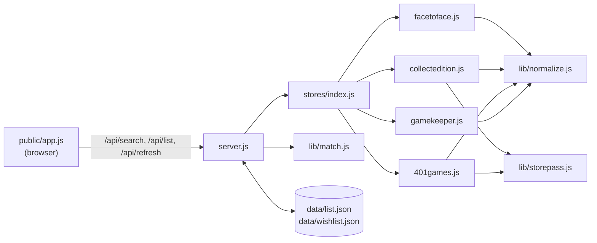

# Architecture

A small local web app with no build step: an Express 5 server, one adapter per store, and a vanilla JS page.
The server fetches each store's public search data on demand, normalizes it, and merges it into one row per
card printing.



## Two modes

Every layer takes a `mode`:

| | `sell` (Selling) | `buy` (Buying) |
|---|---|---|
| Store call | `adapter.search(name)` | `adapter.searchRetail(name)` |
| Price shape | `{ cash, credit, retail }` | `{ price, stock }` |
| Best store | highest credit (or cash, per the UI toggle) | cheapest with `stock > 0` |
| Saved list | `data/list.json` | `data/wishlist.json` |

## Components

### `server.js`
- Serves `public/` and the JSON API (see [README](../README.md#api)).
- `searchAll(query, { mode, force })`:
  - Reduces the query to its front name (`frontName`).
  - Calls every adapter in parallel. A failing store is recorded in `errors` and contributes no offers; it never fails the whole search.
  - Merges the offers with `mergeOffers`.
- **Cache**: in memory, 10 minutes, keyed by `mode|query`. Results with any store error are **not** cached, so the next search retries that store.
- `POST /api/refresh` re-searches each distinct front name in the list (sequentially, `force: true`) and finds each item's row by `item.key ∈ row.keys`. An optional JSON body `{ keys: [...] }` limits it to those cards (one wishlist list, #33). Stores that failed keep their **last known prices** instead of being wiped.
  - The searches take a while and the page keeps saving meanwhile, so the endpoint **re-reads the list before writing**, inside the write queue (below), and only sets `prices` / `updatedAt` on the refreshed cards; stars, moves, removals and adds made during the refresh stay. Cards added meanwhile (their name wasn't searched) are left alone.
  - The page's `refreshPrices(groupId?)` copies only `prices` / `updatedAt` from the response into its own items (matched by `key`), then saves once more, in case a save sent while the server was writing put the old prices back. Running refreshes are tracked in `state.refreshing` (`${view}:${groupId}`, `''` = the whole list), so their buttons keep saying "Refreshing…" through re-renders.
- Lists are written atomically (write a uniquely named `*.tmp`, then rename), **one write at a time per list** (`queued(mode, task)`, #40). Before, overlapping saves shared one temp file and the second rename failed with a 500. `PUT /api/list` and the end of `/api/refresh` (re-read, update, write) both go through the queue.
- The lists live in `data/` unless `DATA_DIR` points elsewhere. `npm run start:test` copies both lists into `data-test/` and serves them on port 3999, so testing never touches the real files.
- Errors are returned as JSON (`{ error }`), because the page always parses JSON.

### `stores/*.js` — adapters
One file per store, registered in `stores/index.js`. The UI builds its columns from this registry.

```js
module.exports = {
  id: 'f2f',                // key in row.prices
  label: 'Face to Face',    // column header
  creditNote: 'cash + 30%', // header tooltip in Selling
  links: { buy, sell },     // store search pages, `{q}` = front name: the page's link for cards saved without a `url`
  search(name),             // -> Offer[] with { cash, credit, retail }
  searchRetail(name),       // -> Offer[] with { price, stock }
};
```

Each adapter maps its store's data onto a shared **printing identity** and then adds the mode's prices.
Per-store sources, fields and quirks are in [STORES.md](STORES.md).

### `lib/storepass.js`
`fetchProducts(host, storeId, name)` is used by Collect-Edition and 401 Games, whose buylists run on the
Storepass platform.
- It makes a count request (`with_count=true` gives `pages`), then fetches up to 10 pages of 24 in parallel and de-duplicates by product id.
- One response carries both the buylist offers and the Shopify retail variants, so both modes use it.

### `lib/normalize.js`
Turns each store's naming into comparable values:
- `normFinish` maps finishes to `nonfoil`, `foil`, `etched`, or a special foil label (`surge foil`, `rainbow foil`…). `finishGroup` collapses those to `nonfoil` / `foil` / `etched` for matching.
- `normTreatment` gives one vocabulary for versions (`Borderless`, `Extended Art`, `Showcase`, `Retro Frame`, `Promo`, `Serial Numbered`…).
- `normCollector`: `"057"` → `"57"`, `"252★"` → `"252"`, lowercased.
- `frontName`: the part before ` // ` or ` - `. Stores join two-name cards differently, so searches use only the front name.
- `looseSetName`: the set name as a sorted word set without filler words, so "Commander: X" matches "X Commander" and "Warhammer 40,000" matches "Warhammer 40000".
- `printingKeys` / `looseKey`: the matching keys (below).
- `coreVersions`: reduces version labels to core words for loose matching ("Borderless Poster" → `borderless`, "Showcase Scrolls" → `showcase`, "Bundle Promo" → `promo`). Labels with no core word are compared as-is.
- `isSerialized`: a `…z` collector number **or** a "Serial Numbered" / "Serialized" label. Serialized copies get a `z` number in `printingKeys` and a `serial numbered` version in `looseKey`, so they never merge with the regular printing (stores mark them differently: F2F `748z`, CE `LTR-748 (Serial Numbered)`).
- `getJson`, `UA`: the HTTP helper and User-Agent shared by all adapters.

### `lib/match.js` — `mergeOffers(offers, query, mode)`
1. **Relevance filter**: store searches are fuzzy, so only offers whose name contains the query are kept.
2. **Pass 1 (exact)**: offers with a collector number get `printingKeys`, which produces three kinds of key:
   - `setCode|number|finishGroup`
   - the same with each `altSetCodes` entry
   - `name:<looseSetName>|number|finishGroup`

   The offer joins the first row that already has any of those keys; otherwise it starts a new row. This is how `CEI` and `IED`, or `PFIN` and `PRE`, end up together.
3. **Pass 2 (loose)**: offers without a collector number (most of Game Keeper's) use `looseKey`, which is `front name | looseSetName | finishGroup | coreVersions`.
   - They join a row only if **exactly one** row has that key.
   - If several rows match, an exact special-foil label (`surge foil`) may single one out.
   - Otherwise the offer gets its own row. Ambiguous listings are never merged by guesswork.
4. **Same store twice in a row**: sell keeps the higher credit; buy keeps the in-stock listing, then the cheaper one.
5. **Output**:
   - sell: rows some store buys, highest credit first.
   - buy: rows some store lists, cheapest in-stock first (rows sold out everywhere go last).

### `public/` — the page
- `index.html` has the header (Selling | Buying, and Store credit | Cash), the search panel, and the list panel.
- `app.js` keeps state in one object: `view`, `sellValue`, `results`, `filters`, `lists: { sell, buy }`, and `excluded: { sell, buy }` (stores left out of the comparison, per view). `search: { seq, abort }` tracks the latest search: each search (and `clearResults()`) aborts the previous request, and a response renders only if it's still the latest, so a slow older search can't replace newer results (#37).
  - Everything that differs by mode lives in the `MODES` config: the value read, eligibility, comparison, subtitle line, labels and totals note, and how sub-lists are grouped (`groupOf`, `setGroup`, `groups`).
  - The rendering functions (`bestStore`, `priceCell`, `renderResults`, `renderList`) are shared.
- Clicking a store's column header (a `.store-toggle` button, in either table) adds it to `excluded` for the current view: `bestStore` skips it, so it never turns green, and its column (prices and totals) is dimmed but still shown. Clicking again removes it.
- Card names (search results and every list table, via `nameButton()`) are `.copy-name` buttons styled as the bold name text. One delegated click handler copies the **front name** (`data-copy`); the `title` tooltip says what will be copied. There's no toast (the user didn't want one): `showCopied()` puts a small "✓ Copied" pill (or "Couldn't copy") right after the clicked name for 1.5 s, then fades it out (#32). It's `position: absolute` with no offsets, so it sits where it would inline but takes no space: it briefly covers the version tags instead of wrapping them onto a new line. One timer per button (`WeakMap`), so a second click restarts it; a re-render just drops it. The page's `frontName()` uses the same rule as `frontName()` in `lib/normalize.js`; keep them in sync. `copyText()` uses `navigator.clipboard.writeText`, which needs a secure context (`http://localhost` is one; a LAN address like `http://192.168.x.x:3000` from a phone is not), and falls back to a hidden `<textarea>` + `document.execCommand('copy')`; it returns whether it copied. The print sheet keeps plain-text names.
- The chosen mode and the excluded stores are remembered in `localStorage` (`mtg-buylist:view`, `mtg-buylist:excluded`; unknown store ids are ignored). Lists are saved through the API after every change (add, remove, star, move, quantity, refresh). `saveList(view)` keeps one `PUT` per list in flight; changes made meanwhile are sent together right after it, as the list is then, so saves never overlap or arrive out of order (#40). A failed save shows `#save-error` under the list header ("Couldn't save: … Your last change isn't stored." with **Retry**) until a save succeeds; any later change retries too.

## Data shapes

```js
// Offer — one store's listing, from an adapter
{ store, name, setName, setCode, altSetCodes?, collectorNumber, finish, treatments[], condition: 'NM', image, raw, url,
  cash, credit, retail }   // sell
  price, stock }           // buy (instead of cash/credit/retail)

// Row — one printing across stores, from mergeOffers
{ key, keys[], name, setName, setCode, collectorNumber, finish, treatments[], image,
  prices: { [storeId]: { cash, credit, retail, url } | { price, stock, url } } }

// List item — saved in data/list.json or data/wishlist.json
{ key, name, setName, setCode, collectorNumber, finish, treatments[], image, prices, updatedAt, starred?, sellTo?, qty?, group? }
```

**Store links (#45).** Each offer carries `url`, the card at that store in that mode (how each store builds it: [STORES.md](STORES.md)). `mergeOffers` keeps it with the store's prices, so lists save it and Refresh updates it. `priceCell()` wraps every price in a link to it (new tab, "Open at <store>"). Cards saved before links existed have no `url` until their next refresh, so `storeLink()` falls back to the store's `links[mode]` search for the front name (from `/api/stores`; `{q}` is the URL-encoded name, `{qq}` the name encoded twice for a search URL nested in a parameter, as Face to Face's buying link needs). Face to Face's links also switch its site-wide buy/sell mode (see STORES.md).

`starred: true` marks a card the user is actually selling or buying. The page shows starred cards first, then sorts each group by card name (then set, collector number and finish) with `compareListItems`. It sorts a copy, so the saved order is unchanged, and its list buttons find items by `key`, not by row position. When some (not all) cards are starred, a subtotal for the starred cards sits under the last one, built with the same `listTotals` / `totalRows` helpers as the footer.

**Sub-lists** are sections under the main list that starred cards are moved into. Each mode's `MODES` entry says how: `groupOf(item)` (the sub-list a card is in, or null for the main list), `setGroup(item, id)`, and `groups()` (the sub-lists, in display order, each `{ id, label, title, chosen?, qty?, print? }`; `label` is the move bar's option text). `renderMoveBar()` and `renderSubLists()` are shared. "Move N starred cards to [sub-list]" sets the group on the main list's starred cards; unstarring a card in a section deletes `starred`, `sellTo`, `group` and `qty`, sending it back to the main list. Every table (main list and each section) is built by `listTable(items, { subtotal, chosen, qty })`; `chosen` tints that store's column.

- **Selling**: `sellTo: '<storeId>'` puts a card in a "Selling to <store>" section, one per store in store order, with that store's column tinted, a quantity and a Print button. An unknown `sellTo` counts as the main list.
- **Buying** (#27): `group: '<name>'` puts a wishlist card in a list the user named (e.g. "Check Lands"). Lists are the distinct `group` values, sorted by name; a list exists while it has cards. The move bar offers the existing lists, then "New list…" (option value `''`), which shows the `#move-name` field; Move is disabled until it has a name. A new name matching an existing list (trimmed, any case, via `byText`) adds to that list. These sections have no tint and no quantity; they have a Print button (`print: true`, #55). Each has its own **Refresh** (`refresh: true` on the group, #33), which refreshes only its cards, and its own "Prices from …" age (`[data-age]`, kept current by `renderUpdated()`).

`qty` (integer ≥ 1, missing = 1) is the number of copies of a card in a "Selling to <store>" section. Sections pass `qty: true` to `listTable`, which adds `qtyStepper()` in the Card cell (#29): no column, just a faint `+` at one copy and `− 2× +` from two (− at 2 goes back to just `+`; removing stays the ✕'s job). It floats right on the set line, not the name line: the name is a button, an unbreakable box that would drop below a float on its line, and a column beside the whole card would wrap long names onto an extra line. Their totals use `listTotals(items, { perCopy: true })`: each store's total is Σ price × qty and "N not bought" counts copies. The price cells and the green "best" still compare one copy. The section's pill shows `N cards · M copies` once some card has more than one. `/api/refresh` updates items in place, so `qty` survives it.

Each section's **Print** button fills the hidden `#print-sheet` with that store's list (name, set/number, finish and tags, quantity, that store's credit and cash as line totals with the unit price under them when qty > 1, totals and a "not bought" count by copies, and cards · copies in the header) and calls `window.print()`. The `@media print` rules print only `#print-sheet`, black on white; it's cleared on `afterprint`. Credit and cash are always both printed, whatever the Store credit / Cash switch says.

In Buying, each wishlist list's **Print** button, and the main wishlist's (`#print-list` in the panel header, shown when `printMain` is set and the main wishlist has cards), call `printWishlist(name)` (`null` = the main wishlist's own cards, not those in lists) (#55). A wishlist isn't tied to a store, so its sheet compares them like the screen: one column per store still in the comparison (stores left out with the header toggle are dropped), price and stock, the `bestStore()` cell in bold with a ★ so it reads in black and white, sold-out prices in grey, then `listTotals()` per store and the "N unavailable" counts. Which function a Print button calls comes from `MODES[view].print(id)`. Both sheets share `printCardCell()` (name + set line) and `printSheet()` (title, date · prices' age · count, `window.print()`).

`key` is the row's primary key when the item was added. Refresh finds the item again through `row.keys`, so it still
matches if the row's primary key changes, for example when a store stops listing it.

## Limits and known gaps
- Near Mint, English only. One row per printing. Only "Selling to <store>" lists have a quantity (`qty`).
- Refresh is sequential per card name. A long list takes a few seconds per distinct card.
- Game Keeper has no collector numbers, so a few ambiguous printings stay unmerged. Its server is also flaky; requests retry 4 times with backoff.
- Prerelease and promo printings are coded differently by each store and sometimes don't merge (e.g. F2F `PFIN 253s` vs CE `PRE 253`). Game Keeper files some promos under catch-all sets ("Miscellaneous Promos"), so those can't be matched.
- Everything relies on undocumented store endpoints and page markup, which can change without notice. See [STORES.md](STORES.md) for how to re-check each one.
